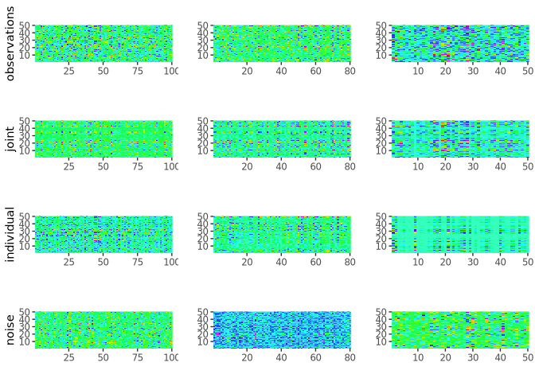
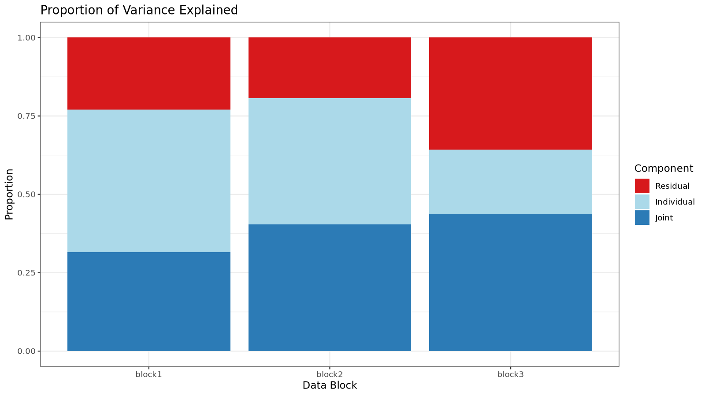
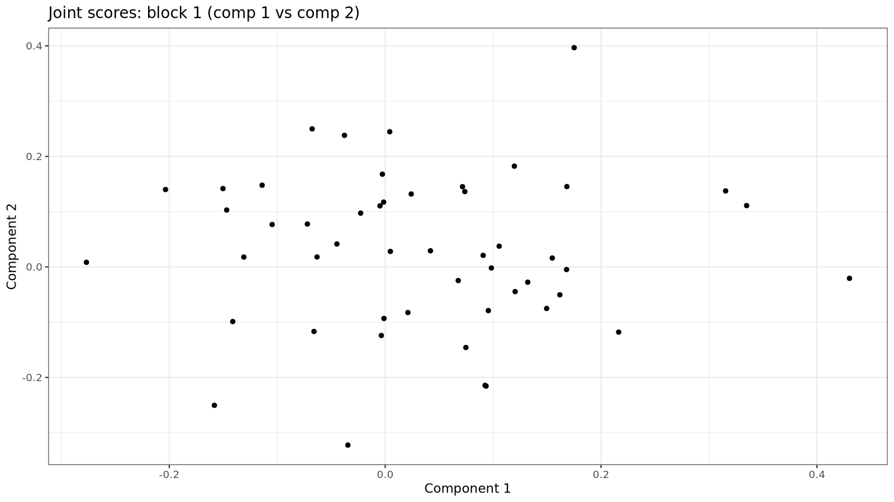
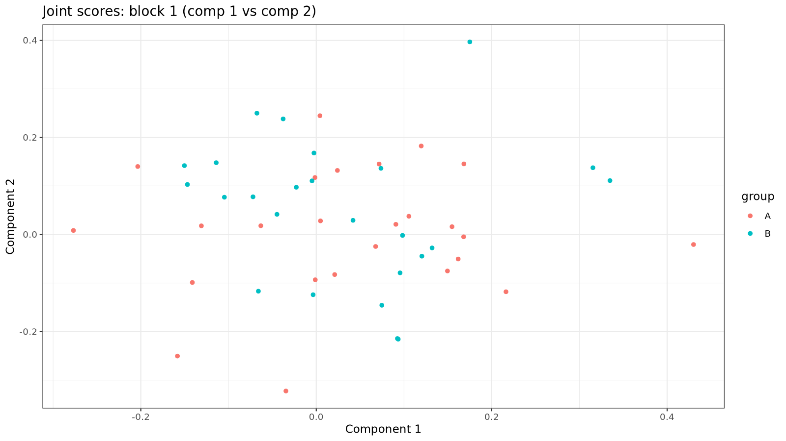
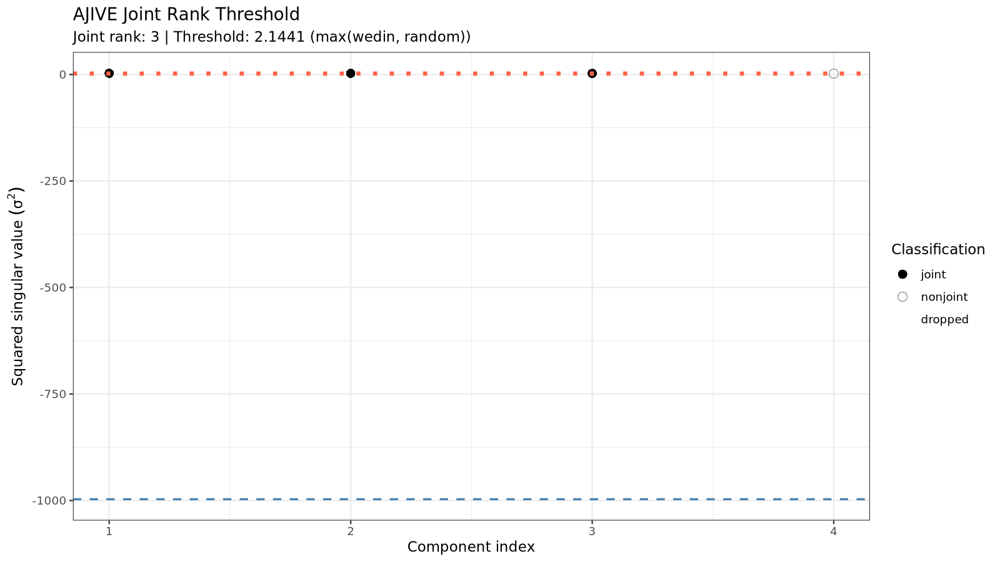
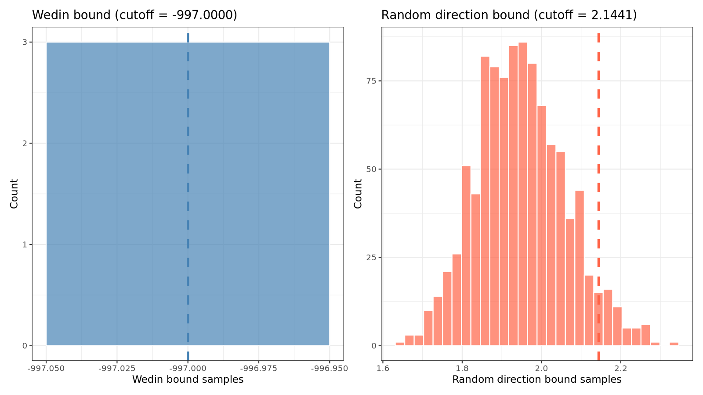
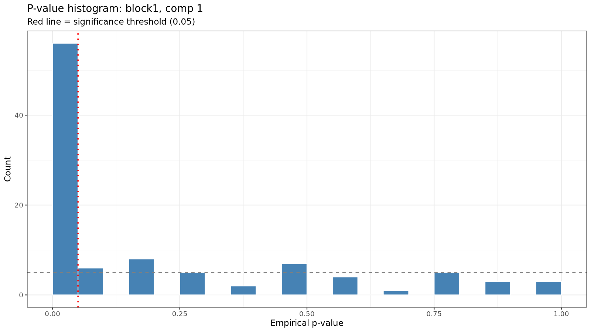
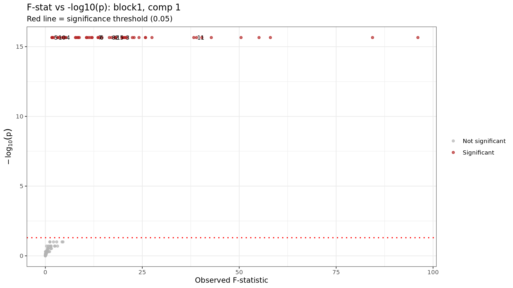
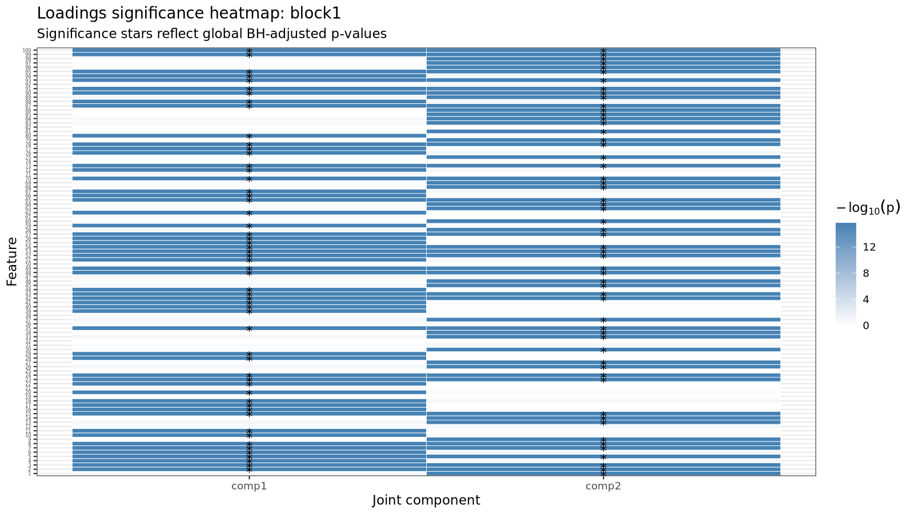

<!-- README.md is generated from README.Rmd. Please edit that file -->

``` r
knitr::opts_chunk$set(
  collapse = TRUE,
  comment = "#>",
  fig.path = "man/figures/README-",
  out.width = "100%"
)
```

# rajiveplus

<!-- badges: start -->

<!-- badges: end -->

rajiveplus (Robust Angle based Joint and Individual Variation Explained)
is a robust alternative to the aJIVE method for the estimation of joint
and individual components in the presence of outliers in multi-source
data. It decomposes the multi-source data into joint, individual and
residual (noise) contributions. The decomposition is robust with respect
to outliers and other types of noises present in the data.

## Installation

You can install the released version of rajiveplus from
[CRAN](https://CRAN.R-project.org) with:

``` r
install.packages("rajiveplus")
```

And the development version from [GitHub](https://github.com/) with:

``` r
# install.packages("devtools")
devtools::install_github("mdmanurung/rajiveplus")
```

## Example

This is a basic example which shows how to use rajiveplus on simple
simulated data:

### Running robust aJIVE

``` r
library(rajiveplus)
## basic example code
n <- 50
pks <- c(100, 80, 50)
Y <- ajive.data.sim(K =3, rankJ = 3, rankA = c(7, 6, 4), n = n,
                   pks = pks, dist.type = 1)

initial_signal_ranks <-  c(7, 6, 4)
data.ajive <- list((Y$sim_data[[1]]), (Y$sim_data[[2]]), (Y$sim_data[[3]]))
ajive.results.robust <- Rajive(data.ajive, initial_signal_ranks)
```

The function returns a list of class `"rajive"` containing the RaJIVE
decomposition, with the joint component (shared across data sources),
individual component (data source specific) and residual component for
each data source.

### Inspecting the decomposition

- Print a concise overview:

``` r
print(ajive.results.robust)
#> RaJIVE Decomposition
#>   Number of blocks : 3
#>   Joint rank       : 2
#>   Individual ranks : 6, 4, 2
```

- Summary table of all ranks:

``` r
summary(ajive.results.robust)
#>   block joint_rank individual_rank
#>  block1          2               6
#>  block2          2               4
#>  block3          2               2
get_all_ranks(ajive.results.robust)
#>    block joint_rank individual_rank
#> 1 block1          2               6
#> 2 block2          2               4
#> 3 block3          2               2
```

- Joint rank:

``` r
get_joint_rank(ajive.results.robust)
#> [1] 2
```

- Individual ranks:

``` r
get_individual_rank(ajive.results.robust, 1)
#> [1] 6
get_individual_rank(ajive.results.robust, 2)
#> [1] 4
get_individual_rank(ajive.results.robust, 3)
#> [1] 2
```

- Shared joint scores (n × joint_rank matrix):

``` r
get_joint_scores(ajive.results.robust)
#>                [,1]        [,2]
#>  [1,]  0.0317272621 -0.36773436
#>  [2,] -0.0910703994 -0.08952300
#>  [3,] -0.0304524796  0.08499404
#>  [4,]  0.2176386020 -0.11452895
#>  [5,]  0.0073799552  0.14106841
#>  [6,]  0.1063938671  0.05934388
#>  [7,] -0.1522858513 -0.28027332
#>  [8,]  0.1461207840  0.04738860
#>  [9,] -0.1971208373  0.09502211
#> [10,] -0.2048410322  0.07308460
#> [11,] -0.0189765249  0.02637854
#> [12,] -0.1318468038  0.09513106
#> [13,] -0.0957413088 -0.03874198
#> [14,] -0.1585044836 -0.04624203
#> [15,] -0.0547837600 -0.03396869
#> [16,] -0.0396344629 -0.04107068
#> [17,]  0.0109240829  0.10938718
#> [18,]  0.2254759882  0.06733554
#> [19,]  0.1125706331  0.15694347
#> [20,] -0.0932451975 -0.19170955
#> [21,]  0.2805232058  0.07776243
#> [22,]  0.0355407924 -0.17810572
#> [23,]  0.0002870187 -0.10377802
#> [24,] -0.0052449156  0.12822856
#> [25,]  0.1306590065  0.01904349
#> [26,]  0.1458131992 -0.12023474
#> [27,] -0.1602631534  0.12438382
#> [28,]  0.0541365756 -0.05132179
#> [29,]  0.1914720526  0.08067936
#> [30,] -0.0903335891  0.02781565
#> [31,] -0.0825411236  0.06417067
#> [32,] -0.1434085146 -0.43590554
#> [33,]  0.1600877461 -0.12077380
#> [34,] -0.0622984140  0.11000174
#> [35,]  0.1489623176  0.13883194
#> [36,] -0.3135535253 -0.02832140
#> [37,] -0.0670455676 -0.20782373
#> [38,] -0.3462207146  0.10552555
#> [39,] -0.0465703442  0.10056064
#> [40,]  0.0006453953  0.06151212
#> [41,]  0.3823997681 -0.11479434
#> [42,]  0.0910416715  0.01710794
#> [43,]  0.0424284906  0.06567764
#> [44,] -0.0143661451 -0.19835893
#> [45,] -0.0559701552  0.23832429
#> [46,]  0.0212659716 -0.05326359
#> [47,]  0.1052431390  0.18443188
#> [48,]  0.0776889099 -0.20053507
#> [49,]  0.0059591131  0.08022512
#> [50,] -0.0616729488 -0.10944906
```

- Block-specific scores and loadings:

``` r
# Joint scores for block 1
get_block_scores(ajive.results.robust, k = 1, type = "joint")
#>               [,1]        [,2]
#>  [1,]  0.011576185 -0.36925169
#>  [2,] -0.097386107 -0.08537105
#>  [3,] -0.024490076  0.08642406
#>  [4,]  0.208286033 -0.12458814
#>  [5,]  0.017953008  0.14078907
#>  [6,]  0.109812425  0.05446676
#>  [7,] -0.167879803 -0.27332403
#>  [8,]  0.149059134  0.04068633
#>  [9,] -0.189804830  0.10412276
#> [10,] -0.200029325  0.08251952
#> [11,] -0.017658088  0.02725313
#> [12,] -0.124604147  0.10123130
#> [13,] -0.098068529 -0.03435151
#> [14,] -0.161422074 -0.03897108
#> [15,] -0.056732046 -0.03145796
#> [16,] -0.041903452 -0.03925633
#> [17,]  0.019499722  0.10893646
#> [18,]  0.229683952  0.05699236
#> [19,]  0.123708218  0.15182913
#> [20,] -0.105613532 -0.18748008
#> [21,]  0.285472231  0.06489368
#> [22,]  0.023498912 -0.17979732
#> [23,] -0.007769529 -0.10383880
#> [24,]  0.004576847  0.12852665
#> [25,]  0.132067266  0.01304742
#> [26,]  0.136181276 -0.12699399
#> [27,] -0.150368586  0.13180819
#> [28,]  0.051388041 -0.05381687
#> [29,]  0.196720326  0.07190487
#> [30,] -0.089187434  0.03196613
#> [31,] -0.078613384  0.06797922
#> [32,] -0.165482402 -0.42936268
#> [33,]  0.150394188 -0.12818947
#> [34,] -0.053554005  0.11291751
#> [35,]  0.159144561  0.13204293
#> [36,] -0.316024894 -0.01392990
#> [37,] -0.080260956 -0.20480029
#> [38,] -0.337487877  0.12149009
#> [39,] -0.038783246  0.10274645
#> [40,]  0.004307046  0.06149619
#> [41,]  0.372754152 -0.13242810
#> [42,]  0.092223523  0.01293045
#> [43,]  0.046433532  0.06374392
#> [44,] -0.027218845 -0.19775665
#> [45,] -0.041236547  0.24095645
#> [46,]  0.018366036 -0.05424914
#> [47,]  0.117314278  0.17965124
#> [48,]  0.064546475 -0.20416536
#> [49,]  0.011321024  0.07997682
#> [50,] -0.070169470 -0.10666533

# Individual loadings for block 2
get_block_loadings(ajive.results.robust, k = 2, type = "individual")
#>               [,1]         [,2]          [,3]          [,4]
#>  [1,]  0.090337800  0.168538714 -0.1663828428  0.1667680532
#>  [2,] -0.232851057  0.066476358  0.0570914982  0.0075400439
#>  [3,] -0.032571278 -0.100431914 -0.0239899947 -0.0471272952
#>  [4,]  0.094868554 -0.059097064  0.0165122042 -0.1718396218
#>  [5,]  0.003557808 -0.023626585 -0.0295830185 -0.1861253992
#>  [6,] -0.089862563 -0.062027654 -0.0075751997 -0.0809185936
#>  [7,]  0.057387835 -0.177332535  0.0599942850 -0.1230323131
#>  [8,]  0.070165907 -0.103826419  0.1018898031  0.1515336261
#>  [9,]  0.156876304  0.167448740 -0.0967307539  0.0952366239
#> [10,] -0.002215269  0.057418478  0.1176186051  0.0882036678
#> [11,] -0.030459881  0.096073071 -0.1059944505  0.0130903080
#> [12,]  0.088301852 -0.105479040 -0.0182979255  0.2234192174
#> [13,]  0.007020191 -0.024873596 -0.3382153757 -0.1701867328
#> [14,] -0.081692998  0.353369838 -0.0688343441 -0.1614255659
#> [15,] -0.088813584  0.043631682 -0.0298403860 -0.0396643468
#> [16,] -0.110797184 -0.103127313 -0.2611735591 -0.1056259608
#> [17,] -0.111650576  0.040134463 -0.0643885237 -0.1390665572
#> [18,]  0.117228600  0.054005563  0.1193596214 -0.0695664114
#> [19,]  0.009342877  0.047493483  0.1713909140  0.1017259851
#> [20,] -0.007405920  0.013775567  0.0297231295  0.1990583069
#> [21,] -0.074529020  0.086317448 -0.0005207752 -0.1129904082
#> [22,] -0.019717735 -0.180159336 -0.1910897911  0.1381366272
#> [23,] -0.131947496  0.037284180  0.0628885287 -0.1259072015
#> [24,] -0.006315858 -0.032427166 -0.0962137008  0.0014248086
#> [25,]  0.017129449  0.070916038 -0.0123917229 -0.1360093431
#> [26,]  0.064713034  0.006324197  0.1469663999 -0.0006513063
#> [27,] -0.064976176  0.115388705 -0.0345903246  0.0290036228
#> [28,] -0.146478380 -0.083853868  0.0197127276  0.0128375211
#> [29,]  0.033000019 -0.149928157  0.0988246630 -0.0793650827
#> [30,] -0.028691876 -0.064037424 -0.1209354285 -0.2486896968
#> [31,] -0.003924910 -0.078152647  0.0052511294  0.0304401632
#> [32,]  0.188724448 -0.089636447  0.2533050331 -0.0977430568
#> [33,] -0.013342005  0.005042721  0.0864719619  0.1722287002
#> [34,]  0.233243483  0.081829588 -0.1247557071 -0.1183688653
#> [35,] -0.008030228 -0.021004124  0.0435468368  0.0703205527
#> [36,] -0.068677760  0.073493624  0.0242963682 -0.0366664708
#> [37,] -0.045774962  0.036955849 -0.0468149093 -0.0718092328
#> [38,]  0.010550351  0.033665559  0.0622936934 -0.1605804325
#> [39,] -0.059528175  0.123002695  0.2335529050  0.0563746353
#> [40,] -0.107870364 -0.146048453  0.1315903681 -0.1039453157
#> [41,] -0.034930630  0.068229673  0.1713059166  0.1630291722
#> [42,]  0.003728068  0.064932399 -0.0322089869  0.1156971534
#> [43,]  0.050385557  0.046025485  0.0147901086 -0.0287134365
#> [44,] -0.290283033 -0.055276203  0.0260780949  0.0137630692
#> [45,]  0.071477357 -0.019266014  0.0632386156 -0.1178688202
#> [46,] -0.030148507 -0.279873560  0.1583590137 -0.0985220149
#> [47,]  0.031137260  0.103482573  0.0638629059  0.1076009188
#> [48,] -0.126397580  0.054008780  0.1939385376 -0.0369876027
#> [49,]  0.192369223  0.050603925  0.1654545851  0.0118304430
#> [50,] -0.083985903  0.139751797  0.1379676565 -0.2623708141
#> [51,] -0.100366167  0.049575036  0.0933153561  0.0231884288
#> [52,]  0.235803298  0.006037663 -0.0209080024 -0.0225341095
#> [53,] -0.160093229 -0.059802047  0.0120706684  0.0193211524
#> [54,] -0.022221020  0.199931180 -0.1282591952  0.0137883676
#> [55,]  0.129324682  0.118612803  0.0398509658 -0.1010404155
#> [56,] -0.256452658 -0.019758954 -0.1131529635  0.1065598877
#> [57,] -0.225130449  0.032709729  0.0089375498 -0.0044737502
#> [58,]  0.178953110  0.302365496  0.0447618023  0.0779796085
#> [59,] -0.079587243 -0.152023891 -0.0061108173  0.1636143171
#> [60,] -0.028319014  0.076634054  0.1321515839 -0.1634333210
#> [61,] -0.017581743  0.020262686 -0.1473095970 -0.0654968880
#> [62,] -0.212062636  0.007174382 -0.0393582844 -0.0153182268
#> [63,] -0.140891934  0.033942599  0.0344001658  0.1641681001
#> [64,] -0.131115232  0.065051911 -0.1168187635  0.1048135673
#> [65,] -0.024861337 -0.075392968  0.0231204450  0.0705668212
#> [66,]  0.157238249  0.046686326 -0.0072921884 -0.0883064656
#> [67,]  0.032158012  0.139341367  0.1056330658  0.0124076697
#> [68,] -0.107890605  0.110925332  0.1377876893  0.2135234150
#> [69,]  0.082245698 -0.346611301 -0.0659747268  0.0390103555
#> [70,] -0.057457333 -0.008527651 -0.0624702413 -0.0836245361
#> [71,] -0.012191659 -0.011354488  0.1280358472 -0.1643512256
#> [72,] -0.065144483  0.020457901  0.0709200988 -0.0591935655
#> [73,]  0.067722816 -0.190331879 -0.0094508427  0.0238472546
#> [74,] -0.115050284 -0.048800246  0.0591552701 -0.0876449676
#> [75,] -0.259874272  0.099700289 -0.0648027790 -0.0804652539
#> [76,]  0.102869052  0.069094194 -0.1949676575  0.0867047480
#> [77,] -0.016187947  0.092262808  0.0827152559  0.0813086898
#> [78,] -0.079975038  0.098847022  0.1450234140 -0.0757889506
#> [79,]  0.014095291 -0.020175638 -0.0030616918  0.0852445960
#> [80,]  0.006461929  0.040208011 -0.1902465851  0.0198087523
```

- Full reconstructed matrices (J, I, or E) for a block:

``` r
J1 <- get_block_matrix(ajive.results.robust, k = 1, type = "joint")
I2 <- get_block_matrix(ajive.results.robust, k = 2, type = "individual")
E3 <- get_block_matrix(ajive.results.robust, k = 3, type = "noise")
```

### Visualizing results

- Heatmap decomposition:

``` r
decomposition_heatmaps_robustH(data.ajive, ajive.results.robust)
#> Warning: `aes_string()` was deprecated in ggplot2 3.0.0.
#> ℹ Please use tidy evaluation idioms with `aes()`.
#> ℹ See also `vignette("ggplot2-in-packages")` for more information.
#> ℹ The deprecated feature was likely used in the rajiveplus package.
#>   Please report the issue at <https://github.com/mdmanurung/rajiveplus/issues>.
#> This warning is displayed once per session.
#> Call `lifecycle::last_lifecycle_warnings()` to see where this warning was
#> generated.
```



``` r
knitr::include_graphics("man/figures/README-heatmap-1.png")
```


- Proportion of variance explained (as a list):

``` r
showVarExplained_robust(ajive.results.robust, data.ajive)
#> $Joint
#> [1] 0.2949278 0.2926559 0.3410587
#> 
#> $Indiv
#> [1] 0.5525968 0.5115758 0.3482157
#> 
#> $Resid
#> [1] 0.1524754 0.1957683 0.3107255
```

- Proportion of variance explained (as a bar chart):

``` r
png("man/figures/README-variance-explained.png", width = 1600, height = 900, res = 150)
print(plot_variance_explained(ajive.results.robust, data.ajive))
dev.off()
#> png 
#>   2

```


- Scatter plot of scores (e.g. joint component 1 vs 2 for block 1):

``` r
png("man/figures/README-scores-joint.png", width = 1600, height = 900, res = 150)
print(plot_scores(ajive.results.robust, k = 1, type = "joint",
                  comp_x = 1, comp_y = 2))
dev.off()
#> png 
#>   2

```


``` r

# Colour points by a grouping variable
group_labels <- rep(c("A", "B"), each = n / 2)
png("man/figures/README-scores-joint-grouped.png", width = 1600, height = 900, res = 150)
print(plot_scores(ajive.results.robust, k = 1, type = "joint",
                  comp_x = 1, comp_y = 2, group = group_labels))
dev.off()
#> png 
#>   2

```


### Jackstraw significance testing

After running the RaJIVE decomposition, you can test which variables in
each data block have statistically significantly non-zero joint loadings
using the jackstraw permutation test.

By default, `jackstraw_rajive()` applies global BH correction across all
block/component/feature tests.

``` r
# Run jackstraw test (increase n_null to 50-100 for publication-quality results)
js <- jackstraw_rajive(ajive.results.robust, data.ajive,
                       alpha = 0.05, n_null = 10)

# Print a concise summary table
print(js)
#> JIVE Jackstraw Significance Test
#>   Joint rank: 2   Alpha: 0.05   Correction: BH
#> 
#>   Block      Component    N features     N significant 
#>   ----------------------------------------------------
#>   block1     comp1        100            56            
#>   block1     comp2        100            57            
#>   block2     comp1        80             50            
#>   block2     comp2        80             45            
#>   block3     comp1        50             34            
#>   block3     comp2        50             23

# Get a data frame summary
summary(js)
#>   block component n_features n_significant alpha correction
#>  block1     comp1        100            56  0.05         BH
#>  block1     comp2        100            57  0.05         BH
#>  block2     comp1         80            50  0.05         BH
#>  block2     comp2         80            45  0.05         BH
#>  block3     comp1         50            34  0.05         BH
#>  block3     comp2         50            23  0.05         BH
```

### AJIVE diagnostics and interpretation helpers

The package now includes unified helpers for diagnostics, metadata
association, and bootstrap stability assessment:

``` r
# Extract AJIVE rank diagnostics (wide or long format)
diag_wide <- extract_components(ajive.results.robust, what = "rank_diagnostics")
diag_long <- extract_components(ajive.results.robust, what = "rank_diagnostics", format = "long")
head(diag_long)
#>   component_index obs_sval obs_sval_sq classification joint_rank_estimate
#> 1               1 1.724992    2.975597          joint                   2
#> 2               2 1.649910    2.722203          joint                   2
#> 3               3 1.433168    2.053970       nonjoint                   2
#> 4               4 1.170100    1.369134       nonjoint                   2
#>   overall_sv_sq_threshold wedin_cutoff rand_cutoff
#> 1                2.135224         -997    2.135224
#> 2                2.135224         -997    2.135224
#> 3                2.135224         -997    2.135224
#> 4                2.135224         -997    2.135224

# Unified diagnostic plots
png("man/figures/README-rank-threshold.png", width = 1600, height = 900, res = 150)
print(plot_components(ajive.results.robust, plot_type = "rank_threshold"))
dev.off()
#> png 
#>   2

```


``` r
png("man/figures/README-bound-distributions.png", width = 1600, height = 900, res = 150)
print(plot_components(ajive.results.robust, plot_type = "bound_distributions"))
dev.off()
#> png 
#>   2

```


``` r

# Associate estimated joint scores with sample-level metadata
metadata_df <- data.frame(group = rep(c("A", "B"), each = n / 2))
associate_components(ajive.results.robust, metadata_df,
                     variable = "group", mode = "categorical")
#> [associate_components] NOTE: Component scores are estimated quantities. Score estimation error is NOT propagated into the returned p-values. Treat results as post-decomposition exploratory associations, not exact fixed-design inference (StatisticalAudits.md, Finding 4).
#>   variable component         stat   p_value     p_adj  method
#> 1    group         1 2.720000e-02 0.8690036 0.9922595 kruskal
#> 2    group         2 9.411765e-05 0.9922595 0.9922595 kruskal

# Bootstrap stability of estimated joint rank
assess_stability(ajive.results.robust, data.ajive, initial_signal_ranks,
                 target = "joint_rank", B = 20)
#> $rank_distribution
#>  [1] 2 3 3 3 2 2 3 3 3 2 2 3 2 2 3 3 2 2 3 2
#> 
#> $rank_table
#> rank_draws
#>  2  3 
#> 10 10 
#> 
#> $observed_rank
#> [1] 2
```

- Retrieve significant variables for a given block and component:

``` r
get_significant_vars(js, block = 1, component = 1)
#>  [1]   2   3   4   5   6   7   8  10  11  15  16  17  18  20  22  23  24  28  29
#> [20]  35  39  40  41  42  43  44  48  49  51  52  53  54  55  56  57  59  62  65
#> [39]  66  67  70  72  73  76  77  78  80  87  88  90  91  93  94  95  99 100
```

- Visualize jackstraw results (three plot types available):

``` r
# P-value histogram
png("man/figures/README-jackstraw-pvalue-hist.png", width = 1600, height = 900, res = 150)
print(plot_jackstraw(js, type = "pvalue_hist", block = 1, component = 1))
dev.off()
#> png 
#>   2

```


``` r

# F-statistic vs -log10(p-value) scatter plot
png("man/figures/README-jackstraw-scatter.png", width = 1600, height = 900, res = 150)
print(plot_jackstraw(js, type = "scatter", block = 1, component = 1))
dev.off()
#> png 
#>   2

```


``` r

# Heatmap of -log10(p-value) across all joint components for one block
png("man/figures/README-jackstraw-loadings-significance.png", width = 1600, height = 900, res = 150)
print(plot_jackstraw(js, type = "loadings_significance", block = 1))
dev.off()
#> png 
#>   2

```


## Function reference

### Core decomposition

| Function | Description |
|----|----|
| `Rajive()` | Run the RaJIVE decomposition on a list of data matrices. Returns an object of class `"rajive"`. |
| `ajive.data.sim()` | Simulate multi-block data with known joint and individual structure for testing and benchmarking. |

### Rank accessors

| Function | Description |
|----|----|
| `get_joint_rank()` | Extract the estimated joint rank from a `"rajive"` object. |
| `get_individual_rank()` | Extract the individual rank for a specific data block. |
| `get_all_ranks()` | Return a `data.frame` of joint and individual ranks for all blocks at once. |

### Component accessors

| Function | Description |
|----|----|
| `get_joint_scores()` | Return the shared n x r_J joint score matrix (r_J = joint rank). |
| `get_block_scores()` | Return the score matrix (U) for a given block and component type (joint or individual). |
| `get_block_loadings()` | Return the loading matrix (V) for a given block and component type. |
| `get_block_matrix()` | Return the full reconstructed matrix (J, I, or E) for a given block and component type. |

### S3 methods for `"rajive"` objects

| Function | Description |
|----|----|
| `print.rajive()` | Print a concise summary of ranks for a `"rajive"` object. |
| `summary.rajive()` | Return and print a `data.frame` of all estimated ranks. |

### Variance explained

| Function | Description |
|----|----|
| `showVarExplained_robust()` | Compute the proportion of variance explained by joint, individual, and residual components for each block (returns a list). |
| `plot_variance_explained()` | Stacked bar chart of variance explained by each component and block. |

### Diagnostics and interpretation

| Function | Description |
|----|----|
| `extract_components()` | Extract AJIVE rank diagnostics in wide-list or long-data-frame format. |
| `plot_components()` | Unified AJIVE diagnostic plotting (`rank_threshold`, `bound_distributions`, `ajive_diagnostic`). |
| `associate_components()` | Test associations between estimated component scores and sample metadata. |
| `assess_stability()` | Bootstrap-based stability assessment for joint rank or loadings (with Procrustes alignment for loadings). |

### Visualisation

| Function | Description |
|----|----|
| `decomposition_heatmaps_robustH()` | Heatmaps of the raw data and the joint, individual, and noise components for all blocks. |
| `plot_scores()` | Scatter plot of two score components for a given block (joint or individual), with optional group colouring. |

### Jackstraw significance testing

| Function | Description |
|----|----|
| `jackstraw_rajive()` | Run the jackstraw permutation test to identify features significantly associated with estimated joint scores. Default multiple-testing correction is global BH across all tests. |
| `print.jackstraw_rajive()` | Print a significance table for a `"jackstraw_rajive"` object. |
| `summary.jackstraw_rajive()` | Return and print a `data.frame` summary of jackstraw results. |
| `get_significant_vars()` | Extract significant variable names/indices for a given block and component from jackstraw results. |
| `plot_jackstraw()` | Diagnostic plots for jackstraw results: p-value histogram, F-stat scatter plot, or loadings significance heatmap. |
